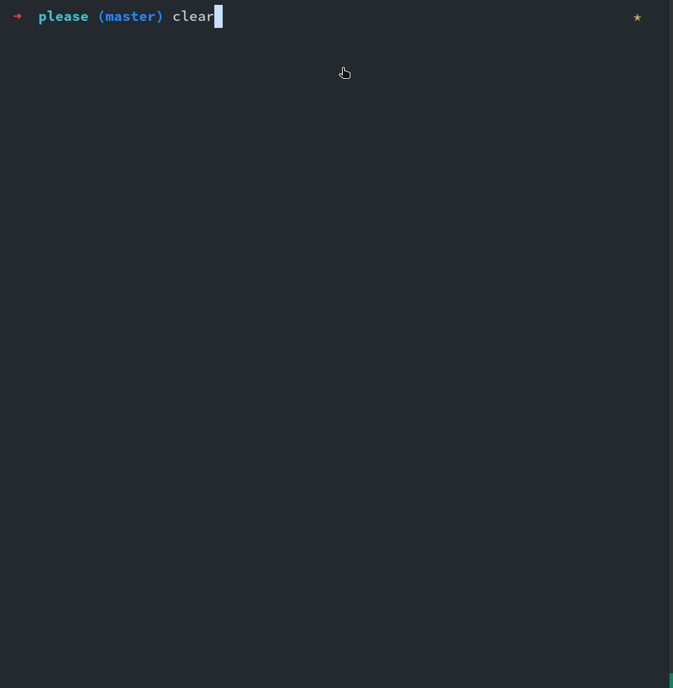

# Please

> Todo list in terminal.

Port of [please](https://github.com/NayamAmarshe/please) CLI by [NayamAmarshe](https://github.com/NayamAmarshe).

## Commands

```bash
# Show name, time and tasks
please

# Add a task
please add "TASK NAME"

# Delete a task
please delete <TASK NUMBER>

# Mark task as done
please done <TASK NUMBER>

# Mark task as undone
please undone <TASK NUMBER>

# Only show done
please show done

# Only show undone
please show undone
```

## Show



**Any idea is recommended!**

## Configuration

### Color, Style

```json
{
  "name": "Civitasv",
  "styles": {
    "intro": {
      "fg": {
        "type": "Basic",
        "value": 10
      },
      "bg": {
        "type": "Basic",
        "value": -1
      },
      "decorations": [1, 3]
    },
    "header": {
      "fg": {
        "type": "Basic",
        "value": 9
      },
      "bg": {
        "type": "Basic",
        "value": -1
      },
      "decorations": [1, 3]
    },
    "tasks": {
      "DONE": {
        "fg": {
          "type": "Basic",
          "value": 10
        },
        "bg": {
          "type": "Color256",
          "value": -1
        },
        "decorations": [0]
      },
      "NOT DONE": {
        "fg": {
          "type": "Basic",
          "value": 9
        },
        "bg": {
          "type": "Basic",
          "value": -1
        },
        "decorations": [1]
      }
    }
  }
}
```

### Tasks

```json
[
  {
    "status": "DONE",
    "task": "B task"
  },
  {
    "status": "NOT DONE",
    "task": "TASK"
  },
  {
    "status": "NOT DONE",
    "task": "TASK A"
  },
  {
    "status": "DONE",
    "task": "B task"
  },
  {
    "status": "NOT DONE",
    "task": "TASK"
  }
]
```
